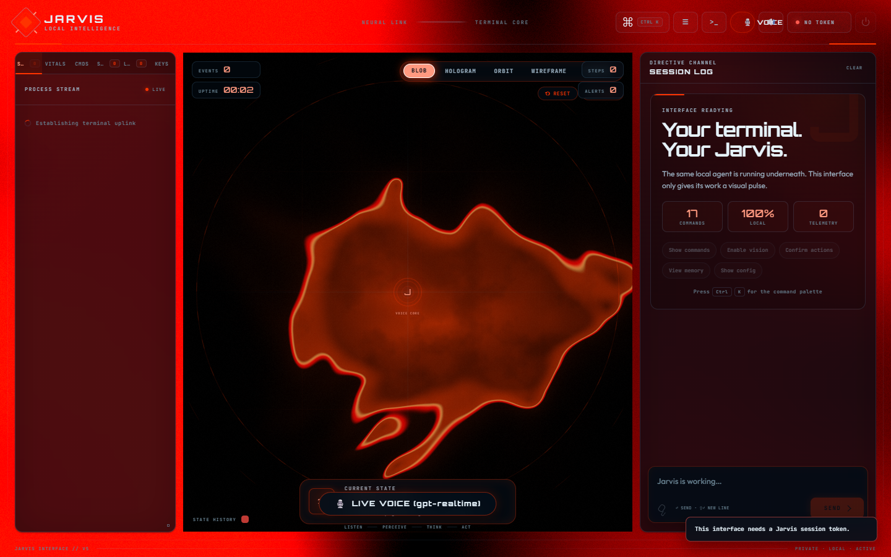

<div align="center">

# ⚡ J.A.R.V.I.S.
### Next-Generation Autonomous AI Desktop Operating Assistant

[](https://www.python.org/)
[](https://github.com/Satvik374/jarvis)
[](LICENSE)
[](https://openrouter.ai/)
[](https://github.com/Satvik374/jarvis)

<br/>



<p align="center">
  <b>Jarvis</b> is an autonomous, full-duplex agentic assistant that perceives your screen, reasons in real time, and operates your desktop directly — moving the mouse, clicking exact UI elements, typing, running commands, and managing complex multi-step workflows.
</p>

[✨ Key Features](#-key-features) • [🚀 Quick Start](#-quick-start) • [🎙️ Voice & TTS](#️-voice--real-time-conversational-ai) • [📱 Mobile Control](#-remote--android-device-orchestration) • [🧠 Architecture](#-grounded-vision--system-architecture)

</div>

---

## 🎥 Demonstration & Video Previews

| Interactive Holographic UI & Spectrum Core | Autonomous Multi-App Desktop Orchestration |
|:---:|:---:|
|  |  |
| *Cyber HUD with Liquid Energy Blob & Audio Amplitude Spectrum* | *Set-of-Marks Precision UI Automation & Vision Loops* |

> 🎬 **Interactive Video Demos:** Full video compositions and hyperframes clips are located in [`videos/jarvis-promo`](videos/jarvis-promo) showcasing high-speed autonomous coding, gaming, and OS navigation.

---

## ✨ Key Features

- 👁️ **Grounded UI Perception (Set-of-Marks):** Uses native Windows UI Automation (UIA) to map every button, input, and menu to precise IDs rather than guessing coordinates.
- 🎙️ **Zero-Latency Conversational Voice:** Supports real-time full-duplex speech with **Gemini 3.8 Live**, **Fish Audio Agents**, and offline **Kokoro-82M ONNX** neural TTS.
- 🔮 **Cyber Holographic Dashboard:** Fluid WebGL SDF shader core (`Liquid Energy Blob`, `Hologram`, `Quantum Orbit`) responding dynamically to Jarvis's thoughts, state, and speech amplitudes.
- ⚡ **Local & Cloud Intelligence:** Runs locally via **Ollama** (Ornith/Qwen) on modest GPUs (4GB VRAM) or connects seamlessly to **OpenRouter / Gemini / DeepSeek**.
- 📱 **Cross-Device Remote & Mobile Agent:** Control paired Android devices and remote workstations over an end-to-end encrypted relay.
- 🗣️ **Offline "Hey Jarvis" Wake Word:** SAPI hardware-level trigger with zero idle cloud data exfiltration.

---

## 🧠 Grounded Vision & System Architecture

```
  ┌──────────────┐     ┌──────────────┐     ┌──────────────┐     ┌─────────────────┐
  │  Perception  │ ──▶ │  Cognition   │ ──▶ │    Action    │ ──▶ │ Feedback Loop   │
  │ UI Tree + UIA│     │ Local / LLM  │     │ Mouse / Keys │     │ State Check &   │
  │ Screen Frame │     │  Reasoning   │     │ Shell / Apps │     │ Next Objective  │
  └──────────────┘     └──────────────┘     └──────────────┘     └─────────────────┘
```

Jarvis bypasses hallucinated coordinates by labeling actionable controls before passing them to the reasoning brain:

```text
[0] Button    "Save Document"         @ (512, 40)
[1] TextField "File name:"            @ (300, 80)
[2] MenuItem  "Export as PDF"         @ (20, 30)
```

The model selects targets deterministically (*"click element 0"*), guaranteeing 100% click accuracy across native and browser applications.

---

## 🚀 Quick Start

### 1. Installation
```bash
# Clone the repository
git clone https://github.com/Satvik374/jarvis.git
cd jarvis

# Install Python dependencies
pip install -r requirements.txt
```

### 2. Configure Brain Backend
Copy the configuration template or use OpenRouter / Ollama:
```bash
cp .env.example .env
```

```yaml
# config.yaml
brain:
  backend: openrouter
  model: deepseek/deepseek-v4-flash-0731:free
  use_vision: false
```

### 3. Launch Jarvis

```bash
# 🔮 Futuristic Animated Cyber Browser Dashboard
python run.py --browser

# 🎙️ Live Voice-Activated Mode (Gemini 3.8 Live)
python run.py --gemini-live

# 💻 Direct CLI Command Execution
python run.py "Open Spotify, play Synthwave, and launch VS Code"

# 👂 Offline Wake-Word Listener ("Hey Jarvis")
python run.py --wake
```

---

## 🎙️ Voice & Real-Time Conversational AI

Jarvis features ultra-realistic neural speech synthesis and seamless barge-in interruption:

- **Local Neural Engine:** Kokoro-82M ONNX (`bm_george` British accent / `af_heart` / `am_adam`) for completely offline voice feedback.
- **Ultra Low-Latency Full-Duplex:** Gemini 3.8 Live WebSockets streaming 16kHz PCM audio bidirectionally.
- **Autonomous Tool Execution via Voice:** Ask Jarvis to check emails, navigate files, or trigger builds while talking naturally without breaking the audio stream.

---

## 📱 Remote & Android Device Orchestration

Jarvis can operate across your paired Android devices and secondary machines:

```bash
# Pair a new remote workstation or phone
python run.py --remote-pair "Office PC"

# Send remote commands securely
python run.py --remote-send "Office PC" "Run test suite and shut down"
```

For Android phones, install the companion APK in [`jarvis_mobile_android/`](jarvis_mobile_android) to enable touch gestures, app dispatching, and mobile screen perception.

---

## 📂 Project Organization

```text
Jarvis/
├── 📁 jarvis/                   # Core autonomous agent runtime & tools
│   ├── 📁 agent/                # Brain reasoning, TOT, and execution loops
│   ├── 📁 browser_ui/           # Holographic Cyber HUD & WebGL shaders
│   ├── 📁 live/                 # Gemini Live & Fish Audio real-time sockets
│   └── 📁 perception/           # UIA element tree walker and screen parsers
├── 📁 assets/                   # High-resolution screenshots, banners, icons
├── 📁 dataset/                  # Autonomous training data generators
├── 📁 models/                   # Local Kokoro neural speech models
├── 📁 jarvis_mobile_android/    # Android companion client
├── 📁 training/                 # LoRA fine-tuning and export pipelines
├── 📁 videos/                   # Hyperframes demo video suites
├── 📄 config.yaml               # Master settings, models & voice configuration
├── 📄 requirements.txt          # Python dependencies
└── 📄 run.py                    # Primary launcher
```

---

## 🛡️ Security & Privacy

- **Local-First Architecture:** Screen analysis, OCR, and TTS run locally without third-party leaks.
- **Safety Confirmations:** Toggle `:confirm on` to approve destructive commands before execution.
- **Protected Sandboxing:** Denylisted shell commands (`rm -rf`, `format`, etc.) are blocked at runtime.

---

<div align="center">
  <sub>Built with ❤️ by Satvik • Designed for high-performance autonomous computing</sub>
</div>
